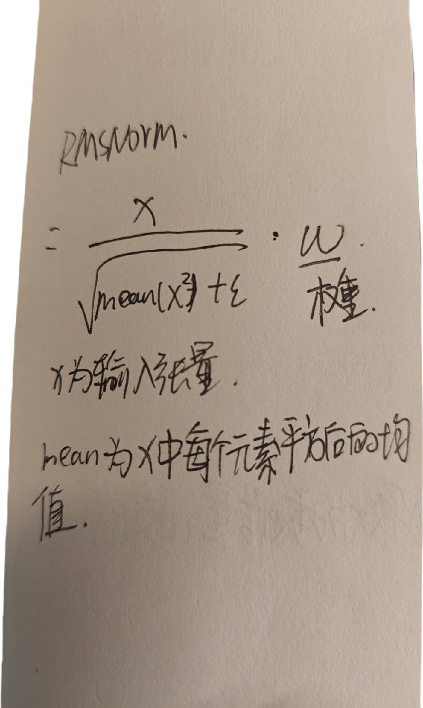
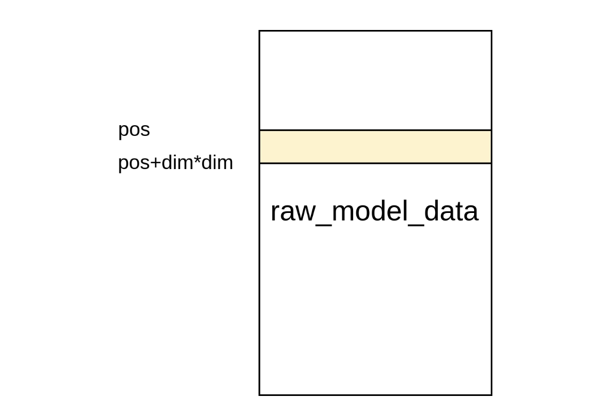
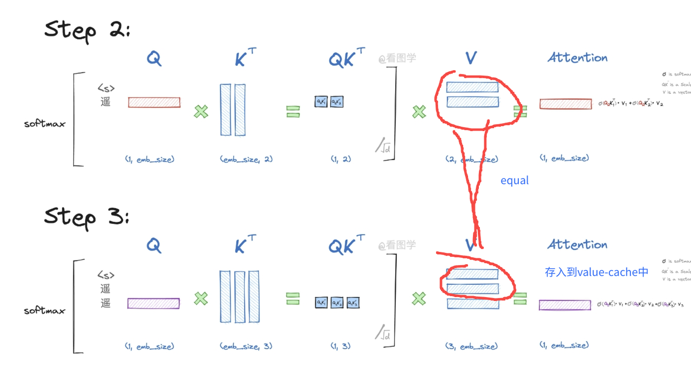

### 1-内存管理和设备类
allocator类来分配不同deive的内存，使用buffer类来管理内存，use_external判断是否由buffer管理，
buffer是智能指针，可以自动释放内存，析构函数去释放ptr
<br>

### 2-算子类的设计

1. base_forward 调用每个算子的前向计算
2. 在base_forward中 get input and weights
3. seletct kernel, 根据设备的类型选择算子的实现,返回函数指针
4. 传入inputs and weights ，调用kernel的计算函数， 将结果返回给到output中
<br>

### 3-张量的设计和实现
张量：多维度数组，在推理流程中管理、传递数据，并结合Buffer类来自动管理内存或者显存资源 <br>
tensor释放的时候，buffer也会释放 <br>
步长为后续所有维度的乘积<br>

### 4-RMSNorm算子的实现

基本公式如下所示: <br>


分CPU和GPU两种实现，CPU实现使用armadillo库，GPU实现使用cuda。
GPU：
最小的执行单元是thread  <br>
最小的调度单元是warp，硬件会一次性把一个wrap放在就绪的硬件执行单元中。 <br>
执行的时候将输入的数据打包成float4，减少内存的访问次数，提高内存带宽利用率。
使用blockreduce
<br>

### 5-RMSNorm算子优化
在做规约的时候，以32个线程为单位进行， 假设一个block有128个线程， 那么将其分为4份，每一份计算完成之后<br>
保存到shared memory中，最后对这四个进行相加， 避免数据竞争重复计算。
<br>

### 6-量化的实现
Andrej karpathy 提供的权重dump工具， int8 weight only , group weight            
这里主要还是减小模型的参数量，使得本来需要4GB的显存的FP32模型，只需要大概1GB多一点就行               
在计算的时候会反量化会到FP32和输入数据进行相乘。
1. 使用transformers库加载llama结构的模型
2. 从模型的配置config.json中构造模型参数
3. 根据配置信息创建一个导出的模型
4. 为导出的模型配置权重，权重来自huggingface的预训练权重
5. 开始导出权重

命令行：
```python
python export.py tinyllama-1.1B.bin --hf /home/modelscope/TinyLlama-1.1B-Chat-v1.0
python export.py /home/modelscope/TinyLlama-1.1B-Chat-v1.0/tinyllama-1.1B-int8.bin --hf /home/modelscope/TinyLlama-1.1B-Chat-v1.0 --version 3

``` 
<br> 

### 7-cuda的向量化存取
常规计算例子：
```cpp
float sum = 0.0f;
for(int i=tid; i<size; i+=blockDim.x){
    sum += in[i] * in[i];
}
```
每次读取四个数据，充分利用带宽<br>
向量化存取例子：
```cpp
  float4* in_pack = reinterpret_cast<float4*>(in);
  for (int i = tid; i < pack_num; i += blockDim.x) {
    float4 in_float4 = *(in_pack + i);
    sum += in_float4.x * in_float4.x;
    sum += in_float4.y * in_float4.y;
    sum += in_float4.z * in_float4.z;
    sum += in_float4.w * in_float4.w;
  }
```
1. 这样会提升内存和L2的吞吐率
2. gpu运算的指令减少，roofline 图往左上移动
3. L2 cache的命中率提升


<br>

### 8-显存的管理
Allocator类里面实现内存分配和释放接口
feature：
+ 调用cudaMalloc等接口有一定的耗时，设计buffer避免重复分配和释放，减少内存分配和释放的开销 <br>
+ 对于小块显存，先不用cudafree释放， 先保存起来，以后用到的时候直接返回该内存块 <br>
+ 设定空闲内存块大于一定阈值，才开始释放 <br>
流程：
1. 当申请显存块的时候，按照大小分为大块显存和小块显存，如果系统中有空闲的显存块，且大小符合规则(最合适的大小,差异小于1MB)，<br>
直接返回该显存块，如果没有的话，就重新申请一块，并按照大小放在big_buffers_或者cuda_buffers中以供记录<br>
2. 当释放显存的时候，根据显存块的大小来将big_buffers或cuda_buffers中的某项置为空闲。<br>
如果空闲的内存块太多，即>1GB，就集中释放其显存块
<br>

### 9-MMap内存映射技术打开大模型的权重文件
+ 以字节为单位打开文件，使用的时候直接按字节数量strncpy即可 <br>
+ 按需加载数据 <br>
+ 减少数据拷贝，直接将文件映射到进程的地址空间 <br> 
权重文件格式: <br>
-- <br>
dim, hidden_dim, layer_num ... 前面的28个字节 <br>
group_size ... 量化参数信息 (optional) <br>
--<br>
floa权重 <br>
--<br>

### 10-算子层的创建和权重的载入
1. 用MMAP打开权重文件之后
2. 计算权重的数量，通过维度累乘
3. 将这块权重指针赋值给Buffer(不管理内存，由mmap自动映射)
4. 将buffer实例赋值给层的权重 
<br>

### 11-权重显存的载入和算子后端的选择
 
权重(主存) - > 算子weight(GPU) <br>
下图为模型权重的文件，黄色区域代表权重的位置<br>


算子后端: <br>
1. 根据传入的device_type 返回对应的kernel函数指针 <br>

### 12-矩阵乘法算子的cuda实现和cpu实现
CPU<br>
+ 调用armadillo库
+ 矩阵内存复用
+ armadillo是列主序，需要转置

GPU<br>
1. 规约计算，每个block负责计算乘法计算中的一行，一个block有多个wrap组成.

<br>

### 13-kv cache机制的实现
将k×dim维度的矩阵query拆分为两部分 <br>
1. 包含0~dim-1 行的query1矩阵，维度为 （dim-1） × dim
2. 第二部分是仅仅包含第K行的query2矩阵，维度为1 × dim。在进行自回归计算时，只需要计算query2矩阵×key矩阵即可。

K cache <br>
1. 将K矩阵分为k1和k2, k1为前面k-1个计算步骤所得到的结果，k2是当前步骤中所得到的结果 <br>
2. k1 也就是之前的计算结果，直接缓存到K cache中，当计算到第K步时，直接从K cache中取出即可。
3. k2 = input_token3 * W_k  ，计算得到K2, 然后qeury 与k1+k2计算
<br>
V cache <br>
等到当前步的时候我们只需要将当前的输入token和Wv矩阵进行相乘得到Value2矩阵，再将它们拼接起来就可以得到完整的Value矩阵并开始注意力的计算。
<br>
显存计算：
<br>
memory = K(步长 or token长度) × dim(V的维度) × N(transformer的层数) × sizeof(float)
<br>



<br> 
<br>


## 生成文本的方法
```shell
./llama_infer llama2_7b.bin tokenizer.model

```

# LLama3.2 推理

- 以 meta-llama/Llama-3.2-1B 为例，huggingface 上下载模型：
```shell
export HF_ENDPOINT=https://hf-mirror.com
pip3 install huggingface-cli
huggingface-cli download --resume-download meta-llama/Llama-3.2-1B --local-dir meta-llama/Llama-3.2-1B --local-dir-use-symlinks False
```
- 导出模型：
```shell
python3 tools/export.py Llama-3.2-1B.bin --hf=meta-llama/Llama-3.2-1B
```
- 编译：
```shell
mkdir build 
cd build
# 开启 USE_CPM 选项，自动下载第三方依赖，前提是需要网络畅通
cmake -DUSE_CPM=ON -DLLAMA3_SUPPORT=ON .. 
make -j16
```
- 运行：
```shell
./build/demo/llama_infer Llama-3.2-1B.bin meta-llama/Llama-3.2-1B/tokenizer.json
# 和 huggingface 推理的结果进行对比
python3 hf_infer/llama3_infer.py
```

# Qwen2.5 推理

- 以 Qwen2.5-0.5B 为例，huggingface 上下载模型：
```shell
export HF_ENDPOINT=https://hf-mirror.com
pip3 install huggingface-cli
huggingface-cli download --resume-download Qwen/Qwen2.5-0.5B --local-dir Qwen/Qwen2.5-0.5B --local-dir-use-symlinks False
```
- 导出模型：
```shell
python3 tools/export_qwen2.py Qwen2.5-0.5B.bin --hf=Qwen/Qwen2.5-0.5B
```
- 编译：
```shell
mkdir build 
cd build
# 开启 USE_CPM 选项，自动下载第三方依赖，前提是需要网络畅通
cmake -DUSE_CPM=ON -DQWEN2_SUPPORT=ON .. 
make -j16
```
- 运行：
```shell
./build/demo/qwen_infer Qwen2.5-0.5B.bin Qwen/Qwen2.5-0.5B/tokenizer.json
# 和 huggingface 推理的结果进行对比
python3 hf_infer/qwen2_infer.py
```
