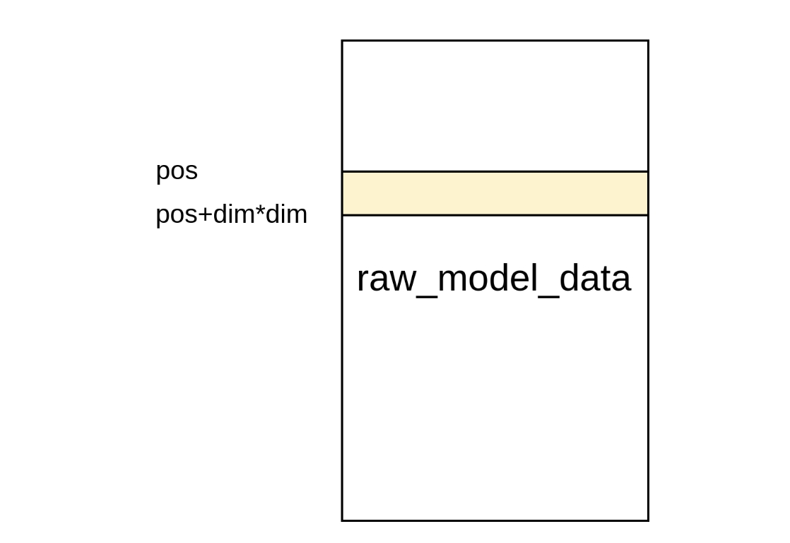
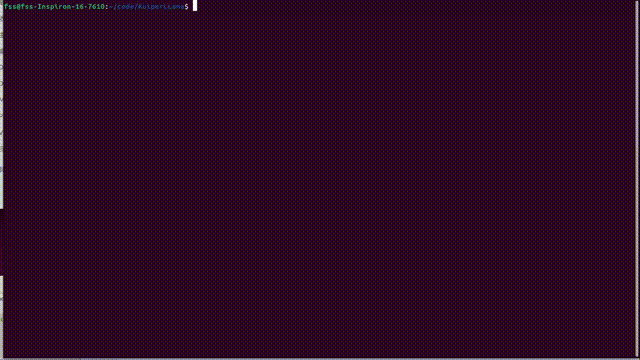

### course1-内存管理和设备类
allocator类来分配不同deive的内存，使用buffer类来管理内存，use_external判断是否由buffer管理，
buffer是智能指针，可以自动释放内存，析构函数去释放ptr
<br>
### course2-算子类的设计

1. base_forward 调用每个算子的前向计算
2. 在base_forward中 get input and weights
3. seletct kernel, 根据设备的类型选择算子的实现,返回函数指针
4. 传入inputs and weights ，调用kernel的计算函数， 将结果返回给到output中
<br>
### course3-张量的设计和实现
张量：多维度数组，在推理流程中管理、传递数据，并结合Buffer类来自动管理内存或者显存资源 <br>
tensor释放的时候，buffer也会释放 <br>
步长为后续所有维度的乘积<br>

### course4-RMSNorm算子的实现

基本公式如下所示: <br>


分CPU和GPU两种实现，CPU实现使用armadillo库，GPU实现使用cuda。
GPU：
最小的执行单元是thread  <br>
最小的调度单元是warp，硬件会一次性把一个wrap放在就绪的硬件执行单元中。 <br>
执行的时候将输入的数据打包成float4，减少内存的访问次数，提高内存带宽利用率。
使用blockreduce
<br>

### course5-RMSNorm算子优化
在做规约的时候，以32个线程为单位进行， 假设一个block有128个线程， 那么将其分为4份，每一份计算完成之后<br>
保存到shared memory中，最后对这四个进行相加， 避免数据竞争重复计算。
<br>

### course6-量化的实现
Andrej karpathy 提供的权重dump工具， int8 weight only , group weight
1. 使用transformers库加载llama结构的模型
2. 从模型的配置config.json中构造模型参数
3. 根据配置信息创建一个导出的模型
4. 为导出的模型配置权重，权重来自huggingface的预训练权重
5. 开始导出权重
<br> 

### course7-cuda的向量化存取
常规计算例子：
```cpp
float sum = 0.0f;
for(int i=tid; i<size; i+=blockDim.x){
    sum += in[i] * in[i];
}
```
每次读取四个数据，充分利用带宽<br>
向量化存取例子：
```cpp
  float4* in_pack = reinterpret_cast<float4*>(in);
  for (int i = tid; i < pack_num; i += blockDim.x) {
    float4 in_float4 = *(in_pack + i);
    sum += in_float4.x * in_float4.x;
    sum += in_float4.y * in_float4.y;
    sum += in_float4.z * in_float4.z;
    sum += in_float4.w * in_float4.w;
  }
```
1. 这样会提升内存和L2的吞吐率
2. gpu运算的指令减少
3. L2 cache的命中率提升
<br>

### course8-显存的管理
Allocator类里面实现内存分配和释放接口
CUDA：
+ 调用cudaMalloc等接口有一定的耗时，设计buffer避免重复分配和释放，减少内存分配和释放的开销 <br>
+ 对于小块显存，先不用cudafree释放， 先保存起来，以后用到的时候直接返回该内存块 <br>
+ 设定空闲内存块大于一定阈值，才开始释放 <br>

### course9-MMap内存映射技术打开大模型的权重文件
+ 以字节为单位打开文件，使用的时候直接按字节数量strncpy即可 <br>
+ 按需加载数据 <br>
+ 减少数据拷贝，直接将文件映射到进程的地址空间 <br> 
权重文件格式: <br>
-- <br>
dim, hidden_dim, layer_num ... 前面的28个字节 <br>
group_size ... 量化参数信息 (optional) <br>
--<br>
floa权重 <br>
--<br>

### course10-算子层的创建和权重的载入
1. 用MMAP打开权重文件之后
2. 计算权重的数量，通过维度累乘
3. 将这块权重指针赋值给Buffer(不管理内存，由mmap自动映射)
4. 将buffer实例赋值给层的权重 
<br>

### course11-权重显存的载入和算子后端的选择
 
权重(主存) - > 算子weight(GPU) <br>
下图为模型权重的文件，黄色区域代表权重的位置<br>


算子后端: <br>
1. 根据传入的device_type 返回对应的kernel函数指针 <br>

### course12-矩阵乘法算子的cuda实现和cpu实现
CPU<br>
+ 调用armadillo库
+ 矩阵内存复用
+ armadillo是列主序，需要转置

GPU<br>
1. 规约计算，每个block负责计算乘法计算中的一行，一个block有多个wrap组成.

<br>

### course13-kv cache机制的实现
将k×dim维度的矩阵query拆分为两部分 <br>
1. 包含0~dim-1 行的query1矩阵，维度为 （dim-1） × dim
2. 第二部分是仅仅包含第K行的query2矩阵，维度为1 × dim。在进行自回归计算时，只需要计算query2矩阵×key矩阵即可。

K cache <br>
1. 将K矩阵分为k1和k2, k1为前面k-1个计算步骤所得到的结果，k2是当前步骤中所得到的结果 <br>
2. k1 也就是之前的计算结果，直接缓存到K cache中，当计算到第K步时，直接从K cache中取出即可。
3. k2 = input_token3 * W_k  ，计算得到K2, 然后qeury 与k1+k2计算
<br>

显存计算：
<br>
memory = K(步长 or token长度) × dim(V的维度) × N(transformer的层数) × sizeof(float)
<br>

<br> 
<br>
<br>
<br>
<br>
<br>
<br>
<br>
<br>
#  News：新课发布，《动手自制大模型推理框架》，全手写cuda算子，课程框架支持LLama2和3.x
Hi，各位朋友们好！我是 KuiperInfer 的作者。KuiperInfer 作为一门开源课程，迄今已经在 GitHub 上已斩获 2.4k star。 如今在原课程的基础上，**我们全新推出了《动手自制大模型推理框架》， 新课程支持Llama系列大模型（包括最新的LLama3.2），同时支持 Cuda 加速和 Int8 量化，自推出以来便广受好评。**

## 《动手自制大模型推理框架》课程目录：

https://l0kzvikuq0w.feishu.cn/docx/ZF2hd0xfAoaXqaxcpn2c5oHAnBc

**如果你对大模型推理感兴趣，想要深入了解并掌握相关技术，那么这门课程绝对不容错过。快来加入我们，一起开启学习之旅吧！
    感兴趣的同学欢迎扫一扫课程下方二维码或者添加微信 lyrry1997 参加课程**


## 项目运行效果
> LLama1.1b fp32模型，视频无加速，运行平台为Nvidia 3060 laptop，速度为60.34 token/s



## 课程目录


**一、项目整体架构和设计**
> 学习架构思维，防止自己只会优化局部实现

1. 环境的安装和课程简介
2. 资源管理和内存管理类的设计与实现
3. 张量类的设计与实现
4. 算子类的设计与实现
5. 算子的注册和管理

**二、支持LLama2模型结构**
> 本节将为大家补齐算法工程师思维，在算法层面讲解大模型和Transformer的原理之后，开始对LLama2进行支持

6. LLama模型的分析
7. MMap内存映射技术打开大模型的权重文件
8. LLama模型文件的参数和权重载入 
9. LLama中各个层的初始化以及输入张量、权重张量的分配和申请
10. 实现大模型中的KV Cache机制

**三、模型的量化**
> 为了减少显存的占用，我们开发了int8模型量化模块
11. 量化模型权重的导出
12. 量化系数和权重的加载
13. 量化乘法算子的实现

**四、Cuda基础和算子实现**
> 带你学Cuda并在实战大模型算子的实现，为大模型推理赋能
14. Cuda基础入门1 - 内容待定
15. Cuda基础入门2 - 内容待定
16. Cuda基础入门3 - 内容待定
17. Cuda基础入门4 - 内容待定
18. RMSNorm算子的Cuda实现
19. Softmax算子的Cuda实现 
20. Add算子的Cuda实现 
21. Swiglu算子的Cuda实现 
22. GEMV算子的Cuda实现 
23. 多头注意力机制的Cuda实现 
24. 让框架增加Cuda设备的支持和管理 
25. 完成Cuda推理流程

**五、用推理框架做点有趣的事情**

26. 文本生成
27. 讲一段小故事
28. 让大模型和你进行多轮对话


**六、学习其他商用推理框架的实现，查漏补缺**

29. LLama.cpp的设计和实现讲解

    *这里有多个小节*
30. Miopen（AMD出品，对标CUDNN）的设计和实现讲解

    *这里有多个小节*
32. 总结

## 第三方依赖
1. google glog https://github.com/google/glog
2. google gtest https://github.com/google/googletest
3. sentencepiece https://github.com/google/sentencepiece
4. armadillo + openblas https://arma.sourceforge.net/download.html
5. Cuda Toolkit

**openblas作为armadillo的后端数学库，加速矩阵乘法等操作，也可以选用Intel-MKL，这个库用于CPU上的推理计算**


## 模型下载地址
1. LLama2 https://pan.baidu.com/s/1PF5KqvIvNFR8yDIY1HmTYA?pwd=ma8r 或 https://huggingface.co/fushenshen/lession_model/tree/main

2. Tiny LLama 
* TinyLLama模型 https://huggingface.co/karpathy/tinyllamas/tree/main
* TinyLLama分词器 https://huggingface.co/yahma/llama-7b-hf/blob/main/tokenizer.model

**需要其他LLama结构的模型请看下一节模型导出**

## 模型导出
```shell
python export.py llama2_7b.bin --meta-llama path/to/llama/model/7B
# 使用--hf标签从hugging face中加载模型， 指定--version3可以导出量化模型
# 其他使用方法请看export.py中的命令行参数实例
```


## 编译方法
```shell
  mkdir build 
  cd build
  # 需要安装上述的第三方依赖
  cmake ..
  # 或者开启 USE_CPM 选项，自动下载第三方依赖
  cmake -DUSE_CPM=ON ..
  make -j16
```

## 生成文本的方法
```shell
./llama_infer llama2_7b.bin tokenizer.model

```
